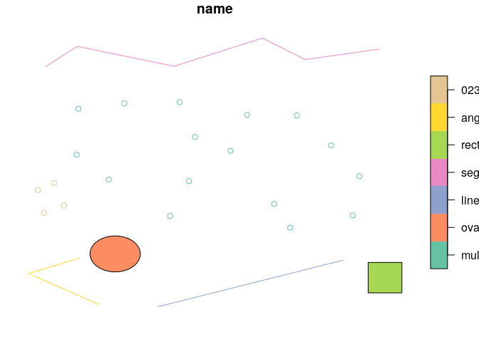

<!-- README.md is generated from README.Rmd. Please edit that file -->
RImageJROI
==========

The goal of RImageJROI is to read 'Fiji/ImageJ' Region of Interest (ROI) Files.

Installation
------------

You can install the released version of RImageJROI from [CRAN](https://CRAN.R-project.org) with:

``` r
install.packages("RImageJROI")
```

or dev version

``` r
# install.packages("remotes")
remotes::install_github("statnmap/RImageJROI")
```

Example
-------

-   Read roi zip file

``` r
library(RImageJROI)
file <- system.file("extdata", "ijroi", "ijzip.zip", package = "RImageJROI")
roi_zip <- read.ijzip(file)
```

Transform roi as sf object
--------------------------

This allows to use tools made for spatial data analyses available for roi objects. This maybe useful for image data analyses.

``` r
roi_zip_sf <- ij_as_sf(roi_zip)
#> [1] 1
#> [1] 2
#> [1] 3
#> [1] 4
#> [1] 5
#> [1] 6
#> [1] 7
roi_zip_sf
#> Simple feature collection with 7 features and 1 field
#> geometry type:  GEOMETRY
#> dimension:      XY
#> bbox:           xmin: 47 ymin: 35 xmax: 722 ymax: 521
#> epsg (SRID):    2154
#> proj4string:    +proj=lcc +lat_1=49 +lat_2=44 +lat_0=46.5 +lon_0=3 +x_0=700000 +y_0=6600000 +ellps=GRS80 +towgs84=0,0,0,0,0,0,0 +units=m +no_defs
#>                          name                       geometry
#> multi_points     multi_points MULTIPOINT (633 200, 520 17...
#> oval                     oval POLYGON ((203.5 163, 202.70...
#> line                     line   LINESTRING (281 35, 615 119)
#> segmented_line segmented_line LINESTRING (681 501, 547 48...
#> rect                     rect POLYGON ((661 115, 661 60, ...
#> angle                   angle LINESTRING (174 39, 47 95, ...
#> 0232-0088           0232-0088 MULTIPOINT (75 205, 111 218...
plot(roi_zip_sf)
```



Further documentation
---------------------

Build and read the vignette included in the package.

``` r
remotes::install_github("statnmap/RImageJROI", vignettes = TRUE)
vignette("read-roi", package = "RImageJROI")
```
